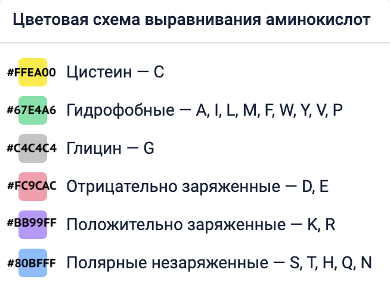
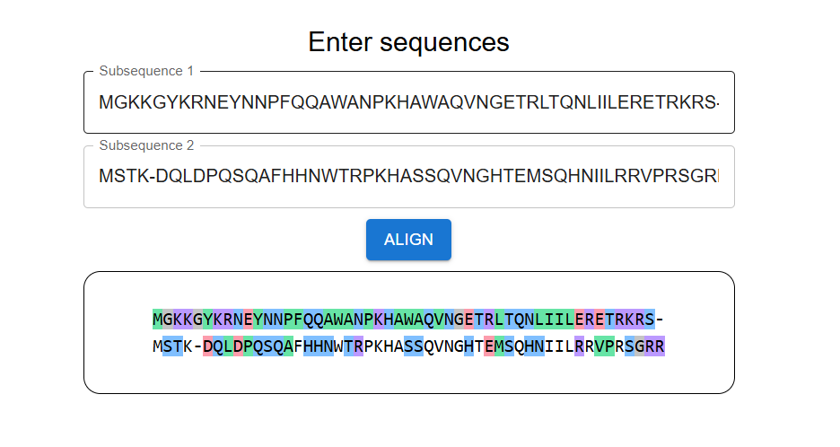

# Визуализация выравнивания аминокислотных последовательностей

https://evgenya2000.github.io/alignment/
Данное React приложение является инструментом для
визуализации [выравнивания аминокислотных последовательностей](https://biomolecula.ru/articles/12-metodov-v-kartinkakh-sukhaia-biologiia).

### Описание

Форма приложения содержит 2 поля для ввода аминокислотных последовательностей и кнопку, по клику по которой ниже появляется визуализация выравнивания.

В верхней строке каждая буква окрашена фоном в свой цвет в соответствии со свойствами аминокислот.
В нижней строке фоном выделены только буквы, отличающиеся от соответствующей по индексу буквы в строке выше.

### Правила ввода

- Поля аминокислотных последовательностей должны принимают строки следующего формата:`VLSPADKTNIKASWEKIGSHG`
- Поля обязательны для заполнения и могут содержать только латинские буквы аминокислот (A, R, N, D, C, E, Q, G, H, I,
  L, K, M, F, P, S, T, W, Y, V) и символ `-`
- Длина введенных последовательностей в обоих полях должна быть одинаковая

### Пример

Визуализация двух выровненных последовательностей:

- `MGKKGYKRNEYNNPFQQAWANPKHAWAQVNGETRLTQNLIILERETRKRS-`
- `MSTK-DQLDPQSQAFHHNWTRPKHASSQVNGHTEMSQHNIILRRVPRSGRR`

